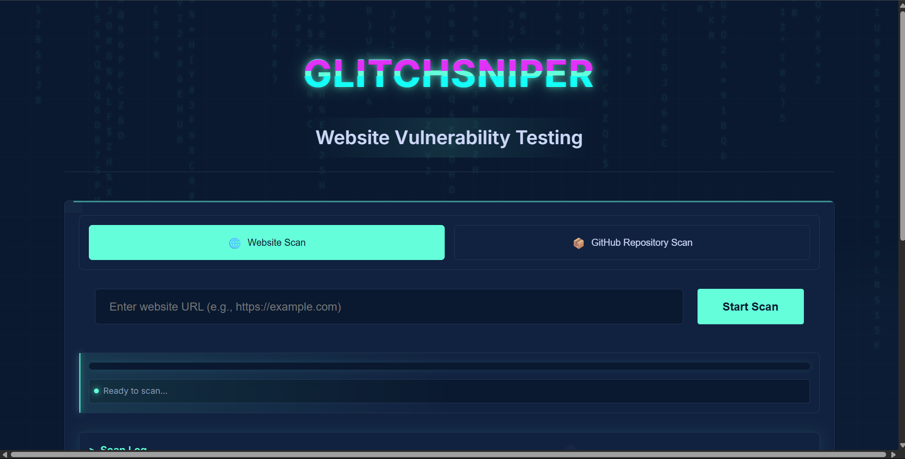
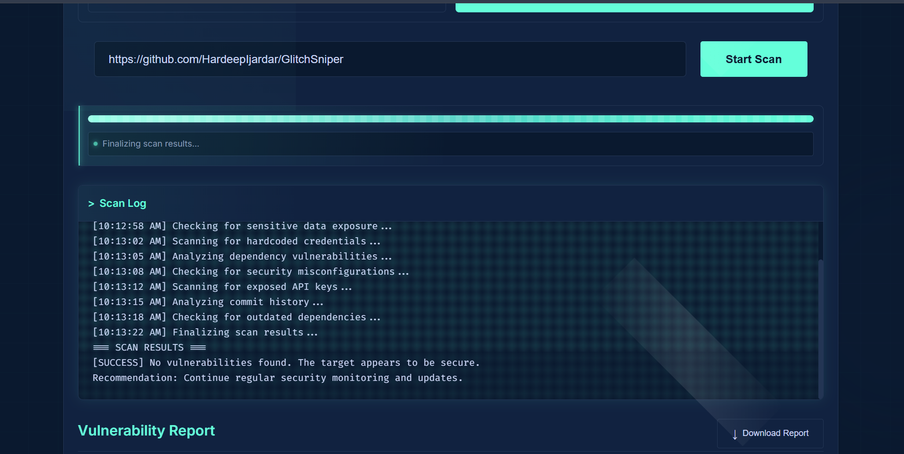

# GlitchSniper

**GlitchSniper** is a professional website vulnerability testing tool with a modern, interactive web interface. It allows users to scan websites or GitHub repositories for common security vulnerabilities, providing detailed reports and actionable insights.

## Features

- 🌐 **Website Vulnerability Scan**: Enter any website URL to scan for common vulnerabilities.
- 📦 **GitHub Repository Scan**: Analyze public GitHub repositories for insecure code patterns (UI only; backend integration required).
- 🚦 **Real-Time Progress**: Visual progress bar and terminal-style scan log.
- 📋 **Vulnerability Report**: Summarized findings with downloadable reports.
- 🎨 **Modern UI**: Futuristic, cyber-themed design with glitch effects and animated backgrounds.

## Demo

### Main Interface


### Vulnerability Report Example


## Getting Started

1. **Clone the repository:**
   ```sh
   git clone https://github.com/HardeepIjardar/GlitchSniper.git
   cd GlitchSniper
   ```
2. **Open `index.html` in your browser.**

> **Note:** This is a frontend-only project. For full vulnerability scanning, backend integration is required.

## Usage

- Select scan mode: Website or GitHub Repository.
- Enter the target URL or repository name.
- Click **Start Scan** to begin.
- View scan progress and logs in the terminal window.
- Review the vulnerability report and download it if needed.

## Folder Structure

```
├── index.html        # Main web interface
├── style.css         # Cyber-themed styles
├── script.js         # UI logic and scan simulation
├── media/            # Screenshots and media assets
└── README.md         # Project documentation
```

## Contributing

Contributions are welcome! Please open issues or pull requests for suggestions, bug fixes, or new features.

## License

This project is licensed under the MIT License. See [LICENSE](LICENSE) for details.

## Contact

- Author: Hardeep Ijardar
- GitHub: [HardeepIjardar](https://github.com/HardeepIjardar)

---

© 2025 GlitchSniper - Professional Security Testing 